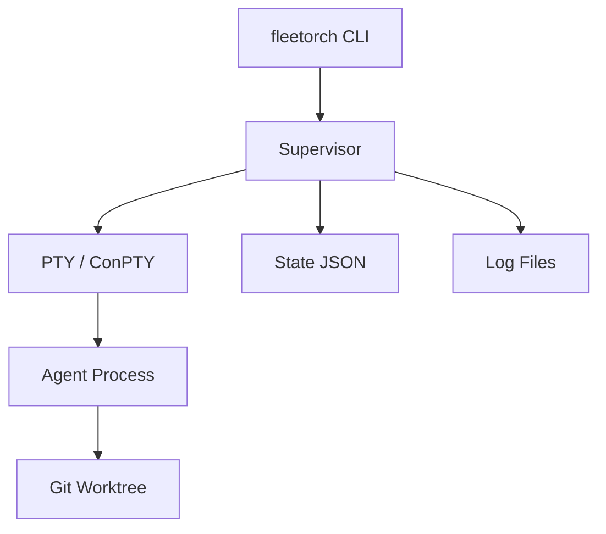

# fleetorch

**A fleet of orchestrated AI coding agents — in one binary.**

`fleetorch` is a cross-platform tool for spawning, managing, and attaching to multiple AI coding agents running in parallel. It automates the heavy lifting of agent orchestration: creating isolated git worktrees, managing PTY-based execution, tracking costs, and providing a unified dashboard to monitor your fleet.

```bash
# Install fleetorch
curl -fsSL https://raw.githubusercontent.com/msnotfound/fleetorch/main/scripts/install.sh | sh

# Spawn an agent for a task
fleetorch spawn claude-sonnet refactor-auth "Refactor AuthMiddleware to use JWT" --repo .

# List all active agents
fleetorch list
```

---

## Why fleetorch?

*   **Single Static Binary:** No runtime dependencies. No `tmux`, `jq`, or GNU coreutils required. Just one binary that works anywhere.
*   **Cross-Platform:** Native support for Linux, macOS, and Windows (via ConPTY).
*   **Plugin Model:** Easily add new agent types (Codex, Gemini, Claude, etc.) by dropping a TOML file into your config directory.
*   **Live Attach:** Seamlessly attach to a running agent's live output from any terminal, even if it was started in the background.
*   **Cost-Routed:** Intelligently route tasks across models (Codex → Gemini → Claude variants) to minimize spend while maximizing output.

---

## Install

### Linux / macOS
```bash
curl -fsSL https://raw.githubusercontent.com/msnotfound/fleetorch/main/scripts/install.sh | sh
```

### Windows (Beta)
Download the latest executable from the [releases page](https://github.com/msnotfound/fleetorch/releases) and add it to your PATH. *Note: Windows support uses ConPTY and is currently in beta.*

### From Source
```bash
go install github.com/msnotfound/fleetorch/cmd/fleetorch@latest
```

---

## Quickstart

1. **Spawn an agent:**
   ```bash
   fleetorch spawn claude-sonnet my-task "Refactor the database connection pool in internal/db" --repo .
   ```
   *Output:* `Task 'my-task' spawned with agent 'claude-sonnet' in worktree: ~/.local/share/fleetorch/worktrees/my-task`

2. **Check status:**
   ```bash
   fleetorch list
   ```
   *Output:*
   ```
   ID       AGENT          STATUS   TURNS  BUDGET  START TIME
   my-task  claude-sonnet  RUNNING  12/150 $0.45   2026-05-27 14:00
   ```

3. **Attach to live output:**
   ```bash
   fleetorch attach my-task
   ```
   *Drops you into the live terminal session of the agent.*

---

## Agent Types

`fleetorch` comes seeded with 5 default agent types. Each is optimized for different workloads and cost profiles.

| Agent Type | Foundation | When to use |
| :--- | :--- | :--- |
| `codex` | GPT-4o (via Codex CLI) | Mechanical CRUD, bulk refactors, boilerplate, and unit tests. |
| `gemini` | Gemini 1.5 Pro | Deep codebase analysis and long-document reading (1M+ context). |
| `claude-haiku` | Claude 3 Haiku | Quick fixes, short structured tasks, and finishing touches. |
| `claude-sonnet` | Claude 3.5 Sonnet | **Default Choice.** Complex architecture, design synthesis, and cross-file logic. |
| `claude-opus` | Claude 3 Opus | Genuinely novel reasoning or high-stakes research where cost is secondary. |

---

## The Cost Ladder

Most parallel-agent tools default to the most expensive models, leading to unnecessary spend. `fleetorch` encourages a "Cost Ladder" approach:

**Codex → Gemini → Haiku → Sonnet → Opus**

Start with the cheapest model capable of the task. If a task is purely mechanical, `codex` or `gemini` will save you significant budget. Move up to `sonnet` or `opus` only when architectural reasoning or high-fidelity code generation is required.

---

## How it Works

`fleetorch` acts as a supervisor for your AI agents. When you spawn a task, it:
1. Creates an isolated **Git Worktree** for the task, ensuring the agent doesn't conflict with your main working directory.
2. Spawns the agent process inside a **PTY (Pseudo-Terminal)**.
3. Pipes all output to a log file while allowing you to **attach** to the live session at any time.
4. Maintains an atomic **State JSON** as the source of truth for all orchestration.



---

## CLI Reference

| Command | Description |
| :--- | :--- |
| `spawn` | Create a new task and start an agent. |
| `list` | Show all tracked tasks and their current status. |
| `watch` | Snapshot or tail the logs of a specific task. |
| `attach` | Drop into the live PTY session of a running agent. |
| `dash` | Launch the interactive TUI dashboard. |
| `kill` | Stop an agent and optionally clean up its worktree. |
| `agent` | Manage agent-type plugins (list, add, remove). |
| `config` | View or edit the global configuration. |
| `logs` | View full history for a specific task. |
| `version` | Display the current version of fleetorch. |

---

## Adding a New Agent Type

To add a new agent, create a TOML file in `~/.config/fleetorch/agents/`:

```toml
# my-custom-agent.toml
name = "my-custom-agent"
command = "custom-agent-cli"
args = ["--model", "turbo", "--prompt", "{prompt}"]
prompt_arg = "{prompt}"
default_budget_usd = 1.50
default_turns = 100
sandbox = "worktree"
streams_freely = true
```

---

## Project Status

**Current Version:** v0.1.0

*   **Linux/macOS:** Stable.
*   **Windows:** Beta (ConPTY integration is new).
*   **Plugins:** Manual TOML placement only; marketplace coming in v0.3.

---

## Contributing

We welcome contributions! Please see our [Contributing Guide](CONTRIBUTING.md) for details.

## License

`fleetorch` is released under the [MIT License](LICENSE).
